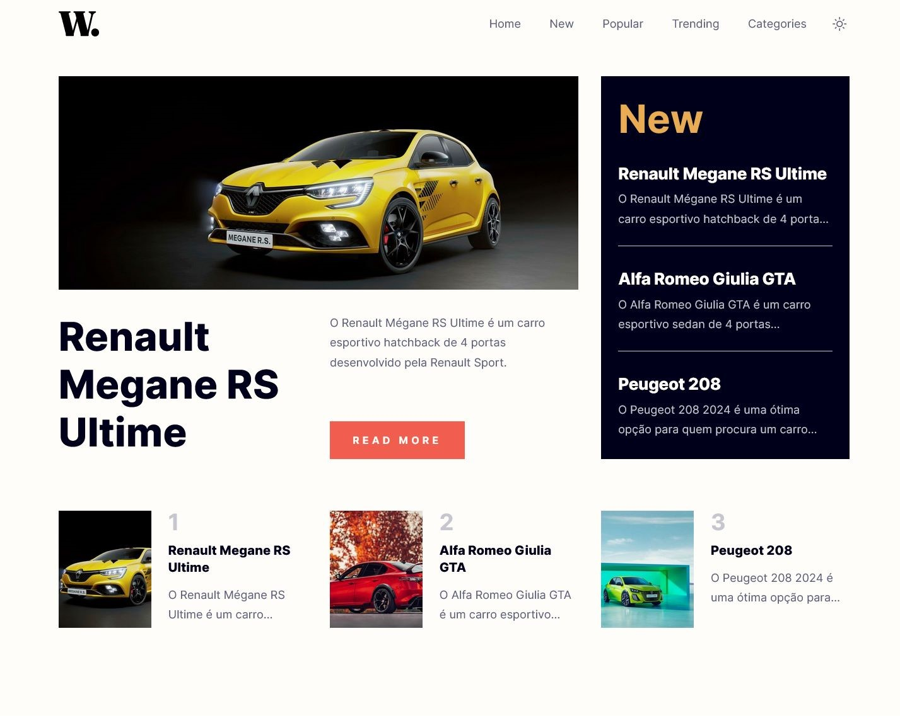
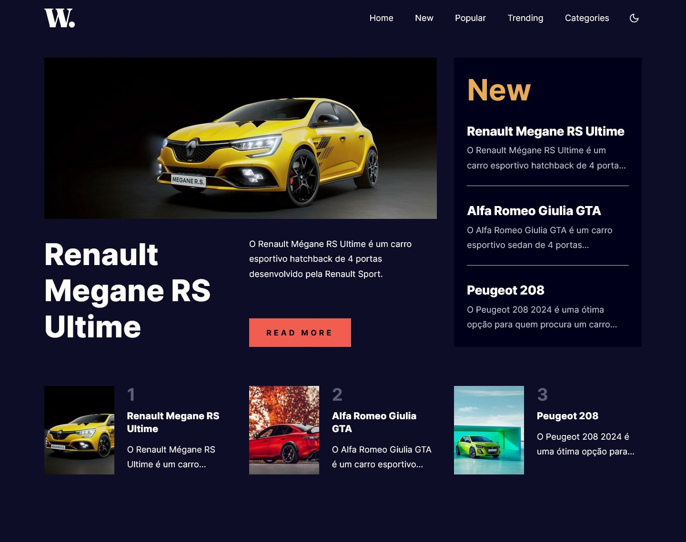

# Frontend Mentor - News homepage solution

This is a solution to the [News homepage challenge on Frontend Mentor](https://www.frontendmentor.io/challenges/news-homepage-H6SWTa1MFl). Frontend Mentor challenges help you improve your coding skills by building realistic projects.

## Table of contents

- [Overview](#overview)
  - [The challenge](#the-challenge)
  - [Screenshot](#screenshot)
  - [Links](#links)
- [My process](#my-process)
  - [Built with](#built-with)
  - [What I learned](#what-i-learned)
  - [Continued development](#continued-development)
  - [Useful resources](#useful-resources)
- [Author](#author)

## Overview

### The challenge

Users should be able to:

- View the optimal layout for the interface depending on their device's screen size
- See hover and focus states for all interactive elements on the page
- Toggle dark mode
- Access page with details about the article

### Screenshot





### Links

- Solution URL: [https://www.frontendmentor.io/solutions/news-homepage-using-vue-3-and-strapi-OMmoTHLla9](https://www.frontendmentor.io/solutions/news-homepage-using-vue-3-and-strapi-OMmoTHLla9)
- Live Site URL: [https://news-homepage-strapi-vue-viniciuscosta89.vercel.app](https://news-homepage-strapi-vue-viniciuscosta89.vercel.app)

## My process

### Built with

- Semantic HTML5 markup
- CSS custom properties
- Flexbox
- CSS Grid
- Mobile-first workflow
- [Vue](https://vuejs.org) - JS framework
- [TanStack Query](https://tanstack.com/query/latest/docs/vue/overview) - Powerful asynchronous state management
- [Pinia](https://pinia.vuejs.org) - The intuitive store for Vue.js
- [Vue Router](https://router.vuejs.org) - Expressive, configurable and convenient routing for Vue.js
- [Vite](https://vitejs.dev) - Frontend Tooling
- [Sass](https://sass-lang.com) - For styles
- [Typescript](https://www.typescriptlang.org) - JavaScript with syntax for types
- [Strapi](https://strapi.io) - Headless CMS

### What I learned

I did this challenge to remember/recap my Vue knowledge. It's been years since I worked with Vue 2 and now Vue 3 it's a little different. It was nice to see the differences between Vue 2 and Vue 3. Since I was working with React the last years I found some similiar things between them. I found Pinia way better than Vuex. Vue-router and vue-query are very similar to their React counterparts.

The greatest challenge was align a 3-column row with a 2-column row on home page so they stay horizontally aligned.

I also had an opportunity to work with Strapi as my Headless CMS.

### Continued development

My plan is to get harder challenges to improve my Vue 3 knowledge.

### Useful resources

- [Docker with Strapi V4](https://blog.dehlin.dev/docker-with-strapi-v4) - This helped me with Strapi and how to host it somewhere, along the next link.
- [Deploy Strapi project on Fly.io](https://forum.strapi.io/t/fly-io-deployment/22438) - I'm a Front-end developer so I have to do a lot of research how to deploy the back-end part from my project.
- Documentations from Pinia, TanStack Query, Vue, Vite, Vou-Router and Strapi.

## Author

- GitHub - [https://github.com/viniciuscosta89](https://github.com/viniciuscosta89)
- Frontend Mentor - [@viniciuscosta89](https://www.frontendmentor.io/profile/viniciuscosta89)

## Project Setup

```sh
npm install
```

### Compile and Hot-Reload for Development

```sh
npm run dev
```

### Type-Check, Compile and Minify for Production

```sh
npm run build
```

### Lint with [ESLint](https://eslint.org/)

```sh
npm run lint
```
